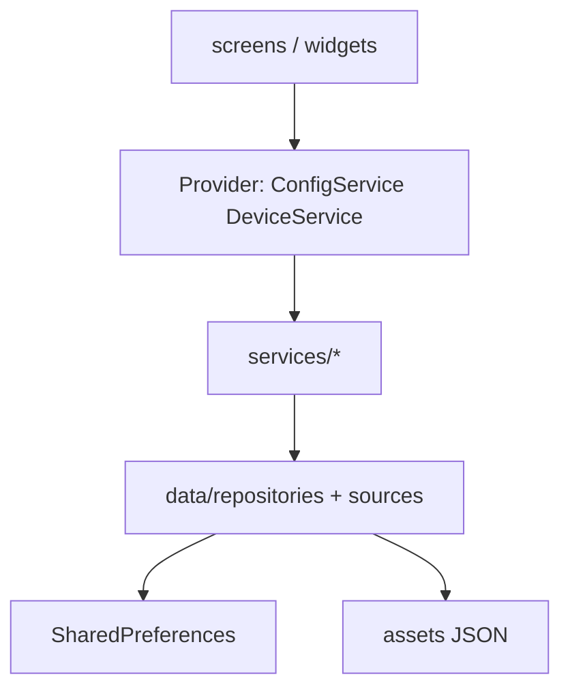

# HomTune アーキテクチャ

## レイヤ構成



## ディレクトリ

| パス | 責務 |
|------|------|
| `lib/app/` | `app_providers.dart`, `router.dart`（go_router） |
| `lib/data/` | 永続化・シードデータ（Repository パターン） |
| `lib/models/` | ドメインモデル（`device.dart` は export 集約） |
| `lib/services/` | ビジネスロジック・外部 API |
| `lib/screens/` | 画面 |
| `lib/widgets/` | 共有 UI・`home/`・`device_detail/` セクション |

## 状態管理（Provider）

`main.dart` で `buildAppProviders()` を登録:

- `ConfigService`, `DeviceService`（ChangeNotifier）
- `NotificationService`, `ManualLinkResolver`, `ApplianceTemplateService`
- `AiUsageService`, `AiRoutingService`
- `ChatService`（`ConfigService` に連動）

**禁止**: 新規 `.instance` シングルトンの追加。既存は Provider 経由で共有する。

## データ境界

- **DeviceRepository**: ユーザーデバイスの merge / persist
- **DeviceLocalSource**: SharedPreferences
- **DeviceSeedSource**: デモ用シード注入
- **DeviceService**: UI 向けオーケストレーション（通知・マニュアル解決の起動）

資産価値（帳簿・市場・表示）の更新方針は [ASSET_VALUATION.md](ASSET_VALUATION.md) を参照。

## ナビゲーション

`go_router`（[`lib/app/router.dart`](../lib/app/router.dart)）:

- `/` — ホーム
- `/onboarding`, `/onboarding-preview`
- `/scan`, `/add-device`
- `/dev-settings` — `kDebugMode` のみ

画面内の詳細遷移は引き続き `Navigator.push` 可。段階的に `context.push` へ移行。

## リリース方針

- 開発者設定（`dev_settings_screen.dart`）は `kDebugMode` の AppBar からのみ。本番削除は [RELEASE_CHECKLIST.md](RELEASE_CHECKLIST.md) 参照。
- クライアント側 Gemini はリリースビルドで無効（`ConfigService.canUseClientSideGemini`）。

## テスト

```bash
flutter analyze lib
flutter test
```

主要: `test/data/device_repository_test.dart`, `test/services/*`, `test/app/homtune_app_test.dart`
